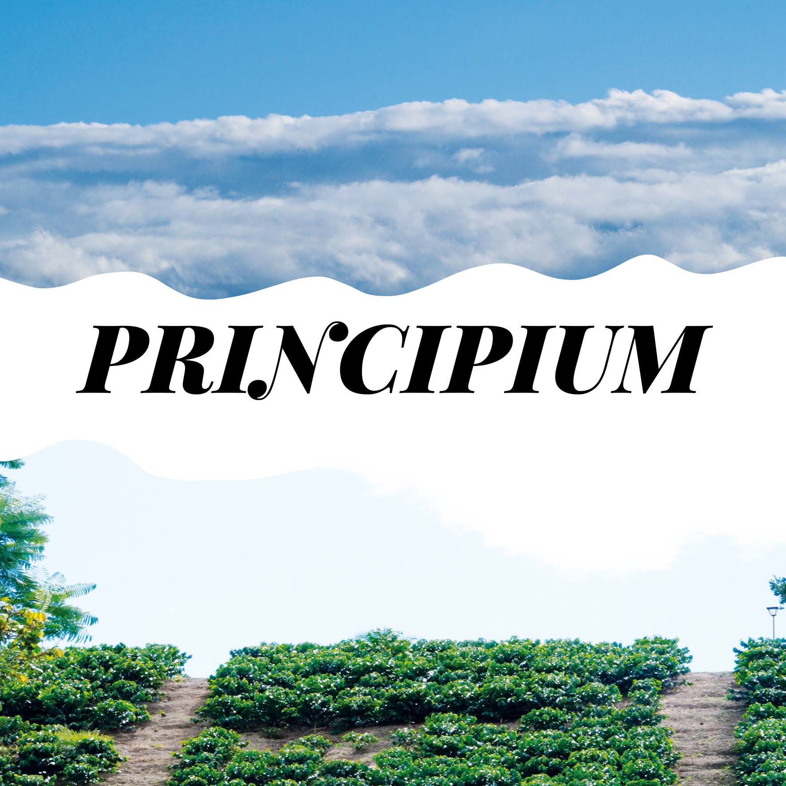

# Portafolio ***PRINCIPIUM***  

El siguiente documento es la combinación y unión de las materias vistas durante los cuatro primeros semestres de Arquitectura en la Pontificia Universidad Javeriana. La información presentada describe el paso por cada una de las asignaturas así como las experiencias y actividades vividas.  
    <b>
        <a
        href="https://issuu.com/sa.bu.ma/docs/portafolio_santiagoburgosmartinez"> PORTAFOLIO (issuu)
        </a>
    </b>

## Logo del Portafolio

  

Los colores usados en el logo del documento se
escogieron con la intención de representar:  
__Blanco__: la verdad y la paz.  
__Negro__: La inteligencia y la modernidad.  
__Naranja__: La energía, la alegría y el equilibrio.  
__Amarillo__: La amistad, la alegría.  
__Verde__: La naturaleza, la calma, la juventud.

## Índice

  

## Proyecto I
Al ingresar a la asignatura de Proyecto 1 se me ha inculcado por sobre todas las cosas, dos conceptos fundamentales, los cuales son la forma y el espacio. Estos conceptos son la base para entender cómo la arquitectura interactúa con las cosas y sus alrededores.  

Ahora, haciendo uso de estos conceptos comencé mi primer acercamiento al mundo de las maquetas para expresar mis ideas y pensamientos a través de objetos creados con mis propias manos, los cuales trataban de transmitir lo que pensaba. Estas __primeras maquetas__ realizadas estaban basadas en objetos y formas que encontraba interesantes y a las cuales les añadía una parte de mi estilo transformándolas para que representaran cosas distintas a las originales.

Posterior a las formas básicas creadas proseguí con la creación de diversas __maquetas__ la cuales estaban enfocadas a buscar una __forma de hábitat__, una vivienda, la cual para efectos del curso era bastante libre en cuanto a requisitos, eran maquetas en las cuales podía dejar libre mi imaginación.

Llegada la mitad del curso, se propuso el proyecto de __“Laboratorio Espacial”__, el cual estaba enfocado en la creación y construcción de un objeto/estructura que era diseñada en conjunto por dos cursos y que el diseño era una competencia entre los mismo estudiantes de los cursos. Luego de varias propuestas se optó por la construcción de varios módulos usando como material base la guadua. Gracias a este proyecto, pude tener mi primer contacto con el mundo de la arquitectura y lo que implica la creación de ideas así como luchar por defenderlas.

Por último, para completar la experiencia de Proyecto 1, el __Proyecto Final__ se centró en la intervención de un espacio o zona del centro de la ciudad de Bogotá, la cual en grupos debíamos intervenir y proponer una reforma del lugar para asi tratar mejorar tanto el espacio así como de dejar nuestra huella en el lugar.

## Proyecto III
Para la materia de Proyecto 3, se llega ahora a la unión de los conceptos trabajados en los dos proyectos previos, es aquí en donde buscamos la unión del espacio con la forma las cuales guiarán en todo momento las ideas y diseños propuestos, además de que abrimos nuestras mentes a un mundo macro en donde ya no observamos la casa o vivienda como un objeto aislado sino que ahora se analiza en conjunto con todas las demás estructuras y edificios que estarán alrededor.

En primera instancia, tuve el __Proyecto de intervenir en el parque de la independencia__, al cual se realizaron diversas visitas para así comprender y estudiar el entorno y las variables que pueden usarse para así crear el mejor proyecto posible en este sector de Bogotá.

  

Posteriormente, se realizaron diversos estudios para comprender cómo ha sido el manejo del espacio público en diversas ciudades alrededor del mundo, y en particular el parque y la obra arquitectónica que me tocaron fue el __Parque de la Villette en parís, y el Guggenheim en Nueva York__, siendo el primero un gran exponente de cómo la intervención del espacio público y en especial de la creación de parque influye en todas las personas que lo visitan así como aquellas que viven en sus alrededores, y el segundo siendo uno de los mayores exponentes del manejo del espacio interior.

  

Por último, como __Proyecto Final__, se propuso de forma grupal la intervención de las zonas aledañas al río arzobispo, comenzando desde la carrera 7ma hasta la calle 45 con diagonal 42ª - Teusaquillo. Partiendo de esta delimitación escogí una zona en especial para intervenir en la cual diseñe y cree mi proyecto de __Galería/Biblioteca__ unida a comercio, siendo estas tres actividades el foco de mis ideas y diseño final.

  

## LINK DEL PORTAFOLIO

    

    <b>
        <a
        href="https://issuu.com/sa.bu.ma/docs/portafolio_santiagoburgosmartinez"> PORTAFOLIO (issuu)
        </a>
    </b>

